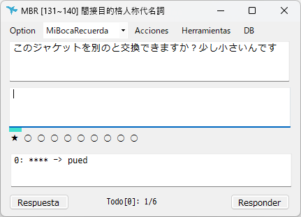
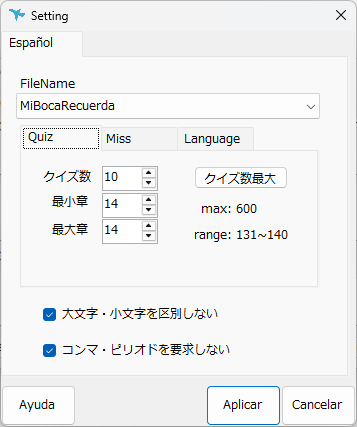
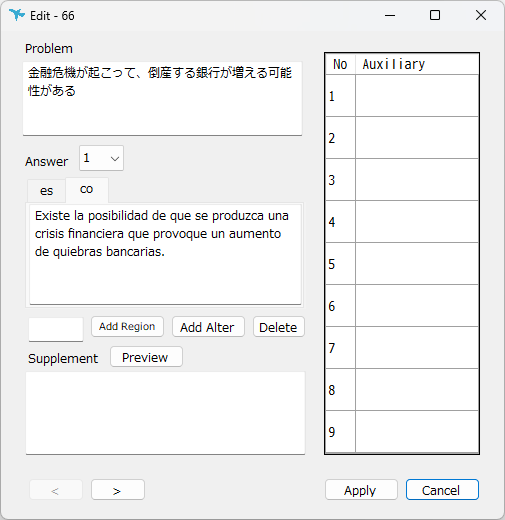
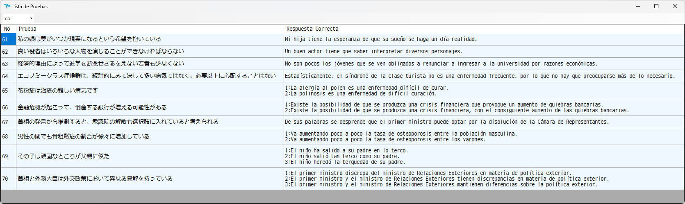

# MiBocaRecuerda

語学学習を効率化するために開発したデスクトップアプリです。

## 概要

コロンビア出身の同僚とスペイン語で会話できるようになりたいという思いから、日々の学習を効率化する目的で開発しました。

スペイン語だけではなく、その他の言語にも対応できるアーキテクチャで設計しています。

---

## 主な機能

- 問題の登録・編集
- 問題一覧表示
- 学習モード
- 正答率の記録
- 多言語対応（英語・スペイン語）
- SQLiteによるデータ管理・検索

---

## 使用技術

|項目|内容|
|---|---|
|Language|C#、Python|
|Framework|.NET (WinForms)|
|Database|SQLite|
|Version Control|Git / GitHub|

---

## 画面

### ホーム画面

学習開始や各画面への遷移を行います。

---

### 設定画面

学習設定や表示設定を変更できます。

---

### 問題編集画面

問題・解答・補足・入力補助などを登録できます。

---

### 問題一覧画面

登録済みの問題を一覧表示しコピー・編集できます。

---

## 工夫した点

- 学習を継続しやすいUIを意識
- データベースを利用して大量の問題を管理
- クラスを役割ごとに分割し保守性を向上

---

## 今後追加したい機能

- AIによる例文添削
- 学習履歴の分析

---

## 動作環境

- Windows 10 / 11
- .NET Runtime

---

## ライセンス

MIT License
